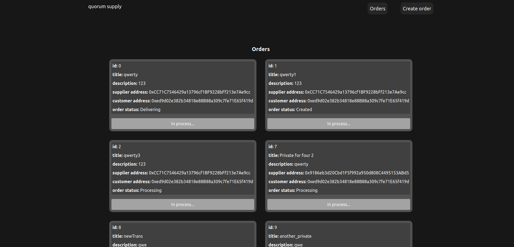
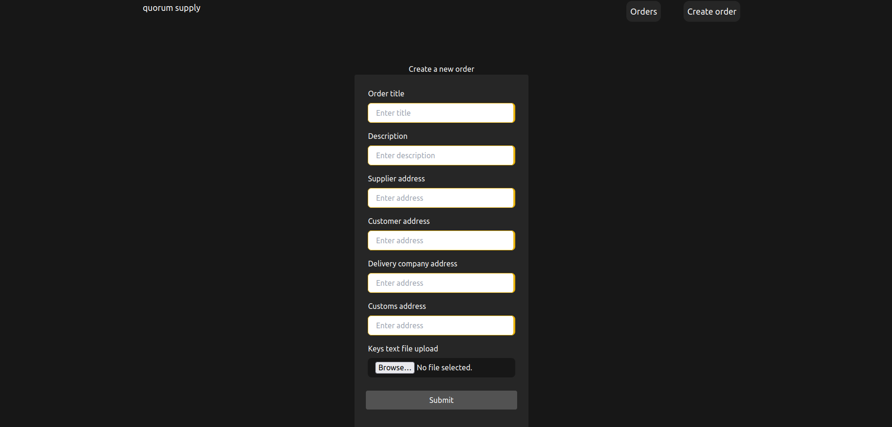

# Quorum supply chain

Simple supply chain dapp with opportunity to make private transactions using quorum private blockchain features.

## Getting Started

To interact with this project locally you need to setup your own quorum network. You can do it using vagrant virtual machine with an already created network. You can do it by next steps:

```
git clone https://github.com/jpmorganchase/quorum-examples

cd quorum-examples
vagrant up

vagrant ssh
```

inside the virtual machine
```
cd quorum-examples/7nodes/

./raft-init.sh
./raft-start.sh
```
Now we have seven Quorum nodes set up that we can use to represent seven different actors on our private network.

For making private transactions you should upload text file to a form with recipients public keys. File should look like that: 
```
oNspPPgszVUFw0qmGFfWwh1uxVUXgvBxleXORHj07g8=
oNspPPgszVUFw0qmGFfWwh1uxVUXgvBxleXORHj07g8=
oNspPPgszVUFw0qmGFfWwh1uxVUXgvBxleXORHj07g8=
oNspPPgszVUFw0qmGFfWwh1uxVUXgvBxleXORHj07g8=
oNspPPgszVUFw0qmGFfWwh1uxVUXgvBxleXORHj07g8=
oNspPPgszVUFw0qmGFfWwh1uxVUXgvBxleXORHj07g8=
...
```
For interacting with other nodes you should change node and tessera port in EthProvider.jsx
```
  const web3default = new Web3("http://localhost:22006"); //node-7
      const web3 = new Web3Quorum(
        web3default,
        "http://localhost:9088", //tessera node-7
        true,
      );
```

### Prerequisites

Vagrant

```
https://linuxhint.com/install-vagrant-ubuntu/
```

### Screenshots



